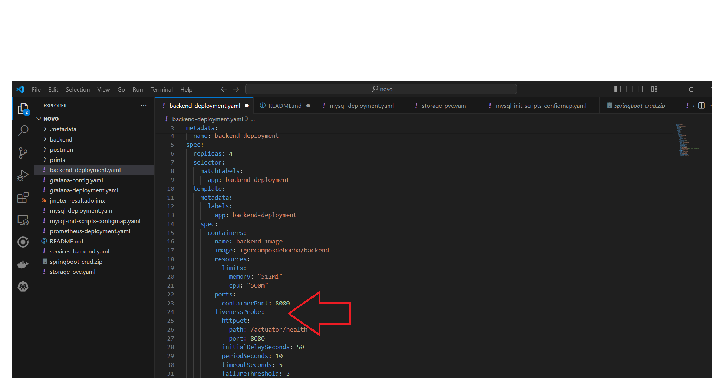
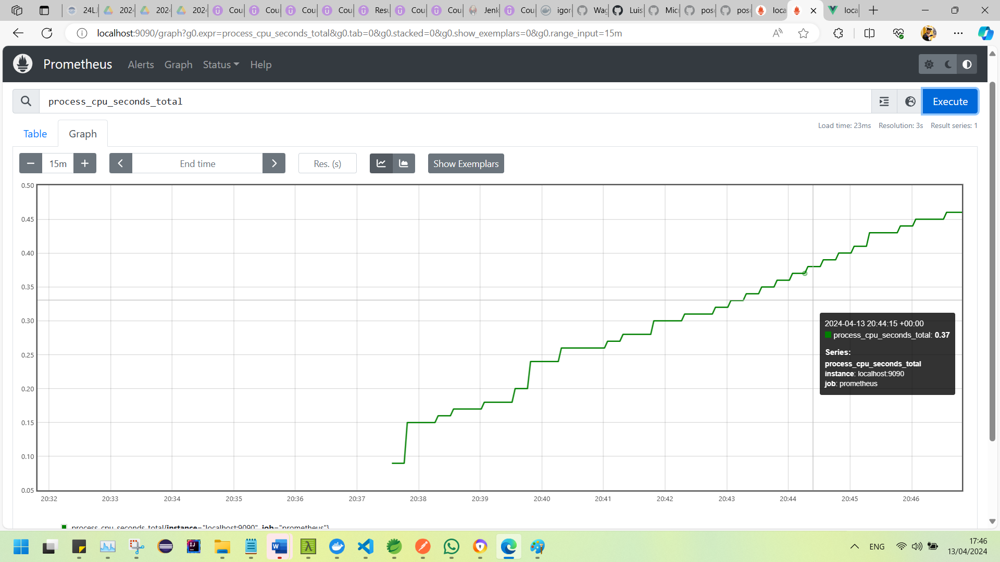

# Documentação do projeto Spring Boot e MySQL

## Resumo
Servidor para consulta e registro de eventos em cidades. Back-end em Spring Boot e banco de dados em MySQL. 
DevOps com Docker, Kubernetes, Prometheus, Grafana e JMeter.

## Recursos do software
- Catálogo de eventos e de cidades
- CRUD: listar, adicionar e deletar Cidades. Listar e atualizar Eventos.

## Arquitetura
- Padrão 3 camadas: back-end gerencia dados de eventos e cidades que entrega ao front-end e banco de dados persiste dados.

## Tecnologias e ferramentas
- Docker: contêineres da aplicação para facilitar implantação
- Kubernetes: gerenciamento de contêineres para orquestrar contêineres a fim de mantê-los sempre em funcionamento.
- Prometheus: coleta de métricas do status da aplicação e sistema.
- Grafana: dashboard de visualização das métricas.
- JMeter: plataforma para teste de desempenho da aplicação.
- Spring Boot: framework com Java para construir back-end de processamento da aplicação.
- MySQL: banco de dados para persistir dados.

## Itens do trabalho:
1) Utilize o Docker para criar uma imagem personalizada de alguma aplicação previamente feita por você.
Servidor funcionando. Retornando requisição.

    a) Publique a sua imagem no Dockerhub.
    Imagem subida no dockerhub. Essa imagem será obtida pelo Kubernetes para construir o back-end.

2) Suba sua imagem em algum cluster kubernetes seguindo as seguintes especificações.:
    a) Utilize Deployment para subir sua aplicação com 4 réplicas.
    Contêineres do kubernetes em execução.
    
     
    Código replicas que cria os 4 contêineres.
    
     
    Todos os contêineres
    
    b) Exponha sua aplicação de modo que ela fique acessível fora do Cluster. (NODEPORT)
    
     
    c) Se sua aplicação fizer uso de banco de dados crie um POD com o mesmo e deixe-o acessível através do ClusterIP. Se sua aplicação não fizer uso de um BD suba uma imagem do Redis e crie um ClusterIP para o mesmo. 
    
     
    d) Crie algum probe para sua aplicação (Readness ou Liveness.)
    
    
      
3) Crie a estrutura para monitorar sua aplicação com o Prometheus e o Grafana (Ou qualquer ferramenta a sua escolha[Você deve ter um servidor de métricas e alguma ferramenta para dashboards.])
    
    a) Apenas o Grafana deverá ficar acessível para fora do Cluster.
    
    b) Utilize um PVC para escrever os dados do Prometheus de maneira persistente.
    
    c) Crie dashboards do Grafana que exponha dados sensíveis da sua aplicação. (Memória, cpu, etc.)
    
4) Utilize o Jenkins (ou qualquer ferramenta) para criar um pipeline de entrega do seu projeto.
Não executado.
      
5) Execute um stress test do seu projeto e tire print do Dashboard sofrendo alterações.
 

## Como executar:
### Pré-requisitos:
- Java
- Docker
- Maven

### Passos para Configuração
1) Clone o repositório do projeto.
2) Navegue até uma pasta anterior à SpringBoot_MySQL_DevOps
3) Execute para criar ou parar o docker a fim de iniciar/parar os comandos .yaml para subir a aplicação: 
kubectl create -f SpringBoot_MySQL_DevOps  
kubectl delete -f SpringBoot_MySQL_DevOps  
4) Acesse os serviços:
Prometheus: 
http://localhost:8080/actuator/prometheus  
http://localhost:8080/actuator/health  
Grafana: http://localhost:3000  
Endpoints e Postman (importe no aplicativo postman): [Postman.json](./postman/postman_eventos_e_cidades_backend.json)  
http://localhost:8080/events   
http://localhost:8080/cities 